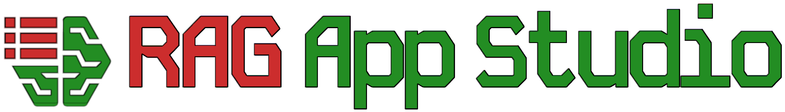

<p align="center">
  
</p>

# Rag App Studio

Rag APP Studio - a low-code / no-code building & serving platform you to build a private LLM chatbot
enhanced (via RAG - Retrieval Augmented Generation) with your own knowledgebase.

To get started or for anything user-oriented [please visit the user documentation](https://byronrthomas.github.io/rag-app-studio-docs/)

The remaining info here is for developers / maintainers..

## Developer background - high-level structure

Rag APP Studio integrates LlamaIndex, vLLM and python web serving frameworks with frontend Javascript
to provide a convenient UX for creating RAG-enhanced chatbots. RAG App Studio is designed to be run on Theta EdgeCloud
although it may also work on other GPU-machine clouds.

For developer convenience reasons, the lower-level stack that our code sits on top of is in another
[github code repo](https://github.com/byronrthomas/theta-vllm-llama-index) and [docker hub repo](https://hub.docker.com/repository/docker/byronthomas712/theta-vllm-llama-index/general). This container image is called `byronthomas712/theta-vllm-llama-index`

All of the python and Javascript code that sits on top of these frameworks is in this repo. The frontend code
is rooted in the frontend directory and the backend code is in the rag_studio directory. There are also dockerfiles
to build the two apps.

### The two apps

There are two sides to the RAG App Studio - building, where the users create and configure and try out their app, and serving / inference where they run it and potentially share it with other users.

The builder app is built via the frontend into `rag_studio/builder_static` and then incorporated into the final
container with the python code via the main `Dockerfile` (see command to build below). The main entrypoint is `studio_webserver.py`

The runner app is built via the frontend info `rag_studio/runner_static` and then incorporated into the final
container with the python code via the main `Dockerfile.inf` (see command to build below). The main entrypoint is `inference_webserver.py`

## Developer instructions

### Developer pre-requisites

In order to develop RAG App Studio, you will need to have followed at least the [user pre-requisites from the user documentation.](https://byronrthomas.github.io/rag-app-studio-docs/pre-requisites.html)

You will also need to have either a serious GPU available locally, or credits and access on a GPU cloud like Theta
EdgeCloud.

Once you have your HuggingFace access token that can write to a repo, as per the user docs, you can either set it
in an environment variable, or 
tell huggingface about it using `huggingface-cli login` (once you've installed the project python deps)


### Install deps

This project was developed with Python 3.11.8 and is not currently intended to be supported for other versions.
We recommend using a tool like `pyenv` with `virtualenv` (or something equivalent like conda/poetry) to install specific python
versions and to keep libraries in use for different projects isolated from each other.

To install deps needed to run without a GPU run:

`pip install -r requirements-cpu.txt`


### Build a new tag - builder app

```
export BASE_TAG=1.0  # Tag of theta-vllm-llama-index to use
make build-fe-builder && docker build -f ./Dockerfile --build-arg BASE_IMAGE_TAG=$BASE_TAG -t "byronthomas712/rag-app-studio-builder:$BASE_TAG" .
```

### Build a new tag - runner app

```
export BASE_TAG=1.0
make build-fe-runner && docker build -f ./Dockerfile.inf --build-arg BASE_IMAGE_TAG=$BASE_TAG -t "byronthomas712/trial-container:$BASE_TAG-prod-inf-1" .
```

### Run studio locally without GPU (so chat / queries / etc don't work properly)

```
DISABLE_FILE_LOGGING=1 flask --app rag_studio.tests.mock_studio_server run --debug --port 8000
```

### Run tests locally that don't need a GPU

```
DISABLE_FILE_LOGGING=1 pytest -m "not needsGpu" -o log_cli=true -o log_cli_level=INFO
```

### Run frontend builder app locally

NOTE: be careful to point this to a cloud-hosted instance or just local by changing `frontend/.env.development`

```
make run-fe-builder
```

### Run frontend runner app locally

NOTE: be careful to point this to a cloud-hosted instance or just local by changing `frontend/.env.development`

```
make run-fe-runner
```

## Known limitations

* If you are using an older GPU like the NVidia V100, and a model that requires the "bfloat16" data type, RAG App studio will automatically choose "float16" which works fine for some models, but isn't guaranteed to work universally

## Design choices

### Inference endpoints

Our inference endpoint is API-compatible with OpenAI's APIs for chat and legacy completions. We kept the API
the same as this is likely to make integrating with clients (including ThetaEdge cloud's UI & documentation) easier.

### Evaluation (QA)

Although we recognise that the ability to evaluate an LLM application built using RAGStudio is important,
most evaluation methods rely on asking a "Gold-standard" LLM model to check the quality of the responses
coming from the LLM application. Given that a core rationale behind using RAGStudio with local models is
to not send prompts or contextual documents to outside services like OpenAI, this form of evaluating a model
doesn't fully make sense as our only options for the "Gold-standard local LLM" are:

1. Use the LLM being used for inference - this is unlikely to give fair evaluations in most cases, since a single model will be checking it's own responses
2. Use a "bigger LLM" model that's running locally - although this is a possibility, it means that all use cases need to specify two models, where one is trusted more - in many cases the user would probably want to use this "better" model for their actual inference rather than a less good one

Given this, we decided to only initially support one forms of evaluation:

1. Use the inference LLM to work out whether the document retrieval is working well - the LLM has not been used for this part of the process, so it can fairly be asked whether some document chunk is relevant to a user's query

We also have plans to support using user-specified pairs of test query and ideal responses, and check the "semantic similarity" of the application's response to the query vs the user-specified "ideal response"

